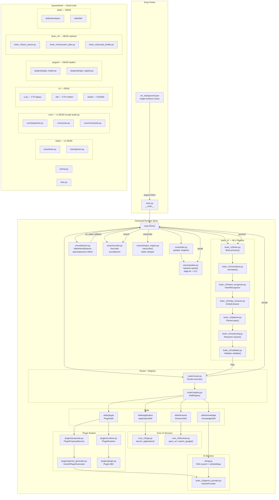

# ROV Architecture Diagram

Canonical runtime spine and dead/quarantined modules.

```mermaid
flowchart TD
    subgraph ENTRY["Entry Points"]
        BG["rov_background.pyw\nsingle-instance mutex"]
        MP["main.py\n__main__"]
    end

    subgraph CANONICAL["Canonical Runtime Spine"]
        ROV["main.ROV()"]
        DET["voice/detector.py\nWakeWordDetector\nopenwakeword 16kHz"]
        REC["voice/recorder.py\nRecorder\nsounddevice"]
        WSP["voice/whisper_engine.py\ntranscribe()\nfaster-whisper"]
        SPK["voice/speaker.py\nSpeaker.speak()\nedge-tts + VLC"]
        AUD["core/audio.py\nspeaker singleton"]

        subgraph BRAIN["brain_v2 — NLU Pipeline"]
            BRN["brain_v2/brain.py\nBrain.process()"]
            NRM["brain_v2/normalizer.py\nnormalize()"]
            INT["brain_v2/intent_recognizer.py\nIntentRecognizer"]
            ENT["brain_v2/entity_extractor.py\nEntityExtractor"]
            PLN["brain_v2/planner.py\nPlanner.plan()"]
            RSN["brain_v2/reasoning.py\nReasoner.reason()"]
            VAL["brain_v2/validator.py\nValidator.validate()"]
        end

        subgraph ROUTER["Router + Registry"]
            RTR["router/router.py\nRouter.execute()"]
            REG["router/registry.py\nSkillRegistry"]
        end

        subgraph SKILLS["Skills"]
            APP["skills/application\nApplicationSkill"]
            BRW["skills/browser\nBrowserSkill"]
            PLG["skills/plugin\nPluginSkill"]
            KNW["skills/knowledge\nKnowledgeSkill"]
        end

        subgraph SVC["Core v2 Services"]
            CV2A["core_v2/app.py\nlaunch_application()"]
            CV2B["core_v2/browser.py\nopen_url / search_google()"]
        end

        subgraph PLUGSYS["Plugin System"]
            PRT["plugins/runtime.py\nPluginRuntime"]
            PRO["plugins/proposals.py\nPluginProposalService"]
            GEN["plugins/gemini_generator.py\nGeminiPluginGenerator"]
            PBC["plugins/plugin.py\nPlugin ABC"]
        end

        subgraph AISVC["AI Services"]
            RAG["ai/rag.py\nRAG search + embeddings"]
            GMP["brain_v2/gemini_provider.py\nGeminiProvider"]
        end
    end

    subgraph QUARANTINED["Quarantined — Dead Code"]
        direction LR
        subgraph BRAIN1["brain/ — v1 DEAD"]
            BB["brain/brain.py"]
            BGM["brain/gemini.py"]
        end
        subgraph CORE1["core/ — v1 DEAD except audio.py"]
            CD["core/dispatcher.py"]
            CR["core/router.py"]
            CC["core/commands.py"]
        end
        subgraph UIDEAD["UI — DEAD"]
            UI1["ui.py — CTk legacy"]
            UI2["uib/ — CTk modern"]
            UI3["studio/ — PySide6"]
        end
        subgraph PLUGDEAD["plugins/ — DEAD loaders"]
            PL["plugins/plugin_loader.py"]
            PR["plugins/plugin_registry.py"]
        end
        subgraph BRAINDEAD["brain_v2/ — DEAD orphans"]
            JP["brain_v2/json_parser.py"]
            EP["brain_v2/execution_plan.py"]
            PB["brain_v2/prompt_builder.py"]
        end
        subgraph SKILLDEAD["skills/ — DEAD"]
            DS["skills/developer/"]
            FS["skills/file/"]
        end
        AC["ai/chat.py"]
        TF["time.py"]
    end

    BG -->|"imports ROV"| MP
    MP --> ROV
    ROV --> DET
    ROV --> REC
    ROV --> BRN
    ROV --> RTR
    ROV --> AUD
    AUD --> SPK
    DET -->|"on_wake callback"| ROV
    ROV -->|"record"| REC
    ROV -->|"transcribe"| WSP
    ROV -->|"process"| BRN
    BRN --> NRM --> INT --> ENT --> PLN --> RSN --> VAL
    VAL -->|"Plan"| RTR
    RTR --> REG
    REG --> APP
    REG --> BRW
    REG --> PLG
    REG --> KNW
    APP --> CV2A
    BRW --> CV2B
    PLG --> PRT
    PLG --> PRO
    PRO --> GEN
    GEN --> GMP
    PRT --> PBC
    KNW --> RAG
    RAG --> GMP
    RTR -->|"results"| ROV
    ROV -->|"speak"| SPK
```
